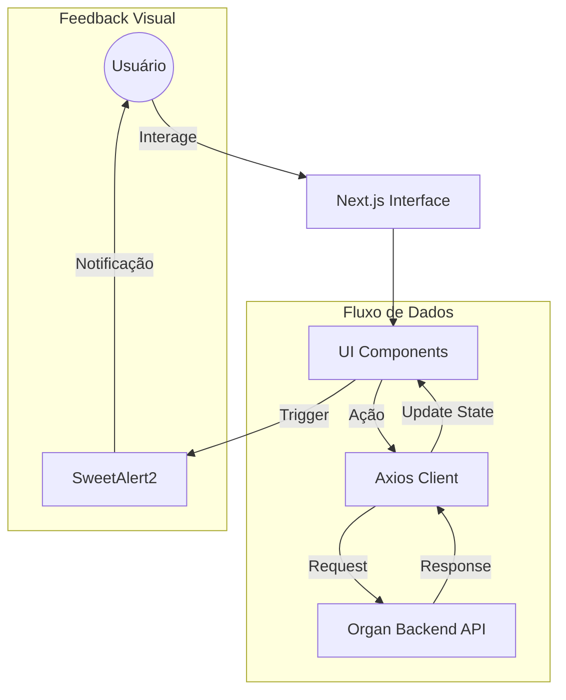

# Projeto Organizacional (Frontend)

Interface de alta produtividade para o ecossistema Organ, projetada para transformar a gestão de rotinas e tarefas diárias em uma experiência visual fluida e intuitiva.

---

## 📖 Sobre o Projeto

O Projeto Organizacional Frontend é a camada de interação do sistema Organ. O objetivo principal é materializar a lógica de produtividade do backend em uma interface que minimize a fricção cognitiva do usuário, permitindo a visualização clara de metas diárias e a estruturação de rotinas recorrentes.

A aplicação foi desenvolvida com foco em performance e simplicidade, utilizando as versões mais recentes do Next.js e Tailwind CSS para garantir que a interação com a agenda de tarefas seja instantânea, independentemente do volume de dados.

O público-alvo são indivíduos focados em alta performance e organização pessoal.

---

## ✨ Funcionalidades

- **Gestão de Tarefas Diárias**: Interface intuitiva para criação, edição e marcação de conclusão de tarefas vinculadas a dias específicos.
- **Planejamento de Rotinas**: Visualização e organização de blocos de atividades recorrentes para estruturação do dia a dia.
- **Feedback Instantâneo**: Implementação de alertas elegantes via `sweetalert2` para confirmações de ações e notificações de erros.
- **Sincronização com Backend**: Integração via Axios para persistência de dados em tempo real com a API do Organ Backend.
- **Design Minimalista e Moderno**: Interface limpa e focada no conteúdo, utilizando Tailwind CSS 4 para garantir responsividade total.
- **Navegação Eficiente**: Roteamento otimizado via Next.js App Router, proporcionando transições rápidas entre a visão de rotinas e a de tarefas.

---

## 🏗 Arquitetura

A aplicação utiliza a arquitetura de **App Router do Next.js**, que permite a separação eficiente entre componentes de servidor (para performance de carregamento) e componentes de cliente (para interatividade).



---

## 📂 Estrutura do Projeto

```text
.
├── src
│   ├── app                # Definição de rotas, páginas e layouts (App Router)
│   ├── components         # Componentes de UI reutilizáveis e modulares
│   └── utils              # Funções auxiliares e configuradores de API
├── public                 # Assets estáticos e imagens
├── next.config.ts         # Configurações do Next.js
├── tailwind.config.ts     # Configurações do Design System Tailwind
└── package.json           # Dependências e scripts do projeto
```

---

## 🛠 Tecnologias Utilizadas

| Tecnologia | Finalidade |
|------------|------------|
| Next.js 15 | Framework para renderização híbrida e roteamento otimizado |
| React 19 | Biblioteca principal para construção da interface |
| TypeScript | Tipagem estática para maior segurança e manutenibilidade |
| Tailwind CSS 4 | Estilização utilitária de última geração para UI responsiva |
| Axios | Cliente HTTP para comunicação com o backend |
| SweetAlert2 | Biblioteca para alertas e modais de feedback elegantes |

---

## 📦 Dependências Principais

- **next**: Núcleo do framework, provendo a infraestrutura de rotas e renderização.
- **axios**: Responsável por todas as chamDessas requisições REST para a API de backend.
- **sweetalert2**: Utilizado para substituir os alertas nativos do navegador por notificações profissionais.
- **tailwindcss**: Motor de estilização que garante a consistência visual do projeto.

---

## ⚙ Fluxo da Aplicação

Usuário $\rightarrow$ Define Rotina $\rightarrow$ Mapeia Tarefas Diárias $\rightarrow$ Interação com Interface $\rightarrow$ Requisição via Axios $\rightarrow$ Resposta do Backend $\rightarrow$ Notificação de Sucesso via SweetAlert2.

---

## 🚀 Como Executar

### Pré-requisitos

- Node.js (Versão LTS recomendada)
- npm ou yarn

---

### Clonando o projeto

```bash
git clone <url-do-repositorio>
cd Projeto-Organizacional/projeto-organizacional
```

---

### Instalando dependências

```bash
npm install
```

---

### Executando em modo de desenvolvimento

```bash
npm run dev
```
A aplicação estará disponível em `http://localhost:3000`.

---

## 🔍 Decisões Arquiteturais

- **Adoção do Next.js 15**: A escolha da versão mais recente visa aproveitar as melhorias de performance do Turbopack e a eficiência dos Server Components.
- **Uso de SweetAlert2**: Decidiu-se por esta biblioteca para evitar a criação de componentes de modal complexos do zero, garantindo feedback visual imediato e profissional.
- **Integração Desacoplada com Axios**: A centralização das requisições em instâncias do Axios facilita a implementação de interceptors para autenticação e tratamento de erros global.

---

## 💡 Boas Práticas Utilizadas

- **Semanitca HTML**: Uso de tags adequadas para melhorar a acessibilidade e o SEO da aplicação.
- **Componentização Modular**: Divisão da interface em componentes pequenos, facilitando a manutenção e a reutilização.
- **Tipagem de API**: Definição de interfaces TypeScript para as respostas do backend, evitando erros de acesso a propriedades inexistentes.

---

## 📚 Aprendizados

Ao analisar este projeto, é possível aprender sobre:
- A implementação de interfaces de produtividade com Next.js 15.
- A integração de sistemas de feedback visual com SweetAlert2.
- O uso de Tailwind CSS 4 para criação de layouts modernos e responsivos.
- O fluxo de comunicação entre um frontend Next.js e um backend NestJS.

---

## 👨‍💻 Autor

[Guilherme](https://github.com/guilherme-dev)
